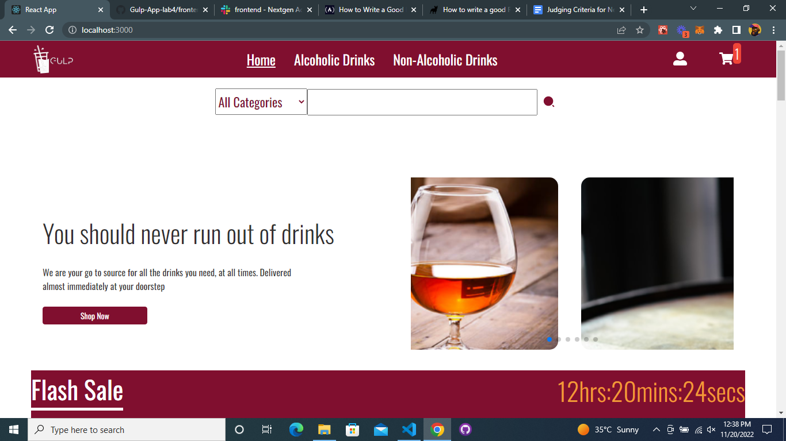

## GULP Drink Project

This gulp drinks web app is am odering nd delivery web app that allows you order and drink of your choice and have it delivered to your door step.

## Installation

for new users of this project, you will need to install the dependencies. To do this, run the following command in the terminal:

1. Clone the repo
2. Cd into the project directory /GULP-APP
3. Run `npm install`
4. Run `npm start` to start the development server
   for existing users, you can simply run the following command in the terminal:

- check out to main branch
- pull the latest changes
- run `npm install`
- run `npm start` to start the development server

## Usage and contrubution

From the main branch, create a new branch with your name as the branch name exmaple feature/your-name-project
Make your changes and contributions
Push your changes to the remote repo and
Create a pull request to the main branch
